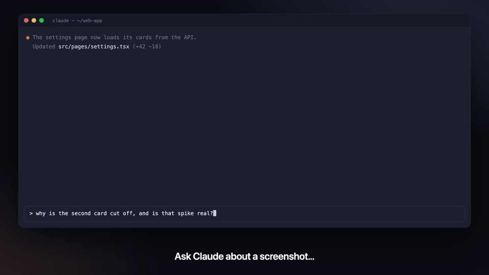
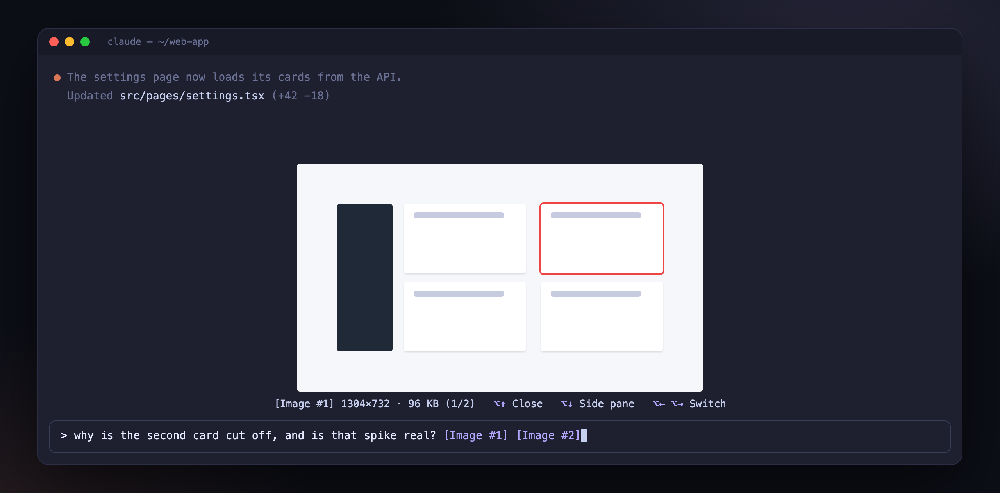
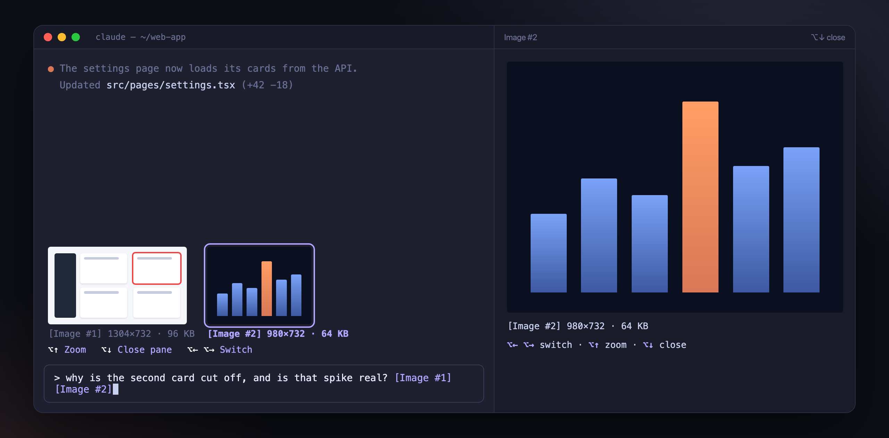

# claude-code-mods



| Mod | What it does |
| --- | --- |
| [paste-peek](plugins/paste-peek) | See the images you paste into the prompt, in real pixels, right above it. Switch with ⌥←/⌥→, zoom with ⌥↑, side pane with ⌥↓. **Terminal: Ghostty or kitty** (macOS). |
| [agent-monitor](plugins/agent-monitor) | Watch your subagents: a live band above the prompt, and `/sub` with history, alerts (file conflicts, stalls, tier mismatches, denied calls), per-agent detail and a cost estimate. English UI, Chinese optional. |
| [pr-hint](plugins/pr-hint) | See your branch's open PR on the prompt hint row; hover the hint row to preview a card of the spec, integration branch, CI and every ticket's progress, click the PR number to keep it open. Needs `gh`. English UI, Chinese optional. |

### Zoom — ⌥↑

Pick an image with ⌥← / ⌥→, then press **⌥↑**: it opens centered above the prompt, as large as that area allows (about half the screen in the fullscreen layout). Press ⌥↑ again to close.



### Side pane — ⌥↓

Press **⌥↓** to open the selected image in a pane that fills the screen's height, docked on the right in the fullscreen layout; the thumbnails stay above the prompt and ⌥← / ⌥→ still switch. Press ⌥↓ again to close.



## Install

In Claude Code (2.1.287 or later):

```
/plugin marketplace add nokiy/claude-code-mods
/plugin install paste-peek@nokiy-mods
```

The first command adds this repository as a plugin marketplace (once); the second installs a mod from it. Start a new session afterwards.

## Releasing

Every release bumps only the last digit of a mod's version. Steps: [docs/releasing.md](docs/releasing.md).

## License

MIT
